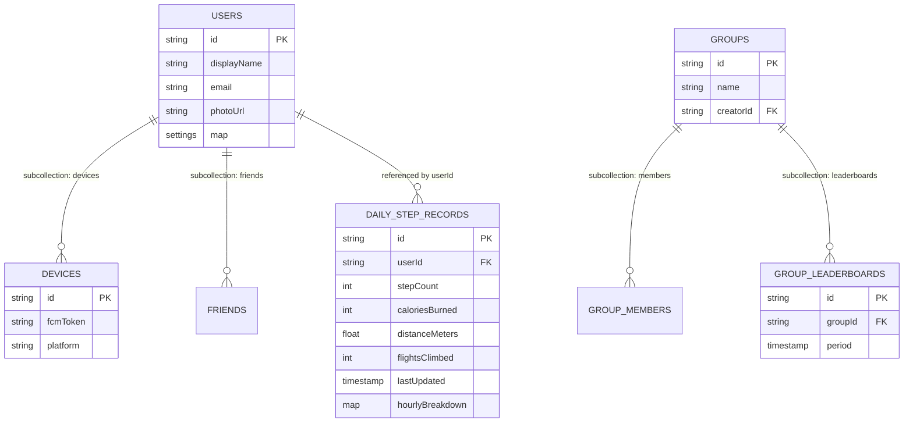

# High Level Design for Kadam

## Overview
Kadam is a step tracking mobile application that enables users to track their steps from multiple devices and engage with friends through social features and competitive leaderboards. The app is built with Flutter for cross-platform support and uses Firebase as its backend infrastructure.

## Core Features
1. **Step Tracking** - Track steps from multiple devices with synchronization
2. **Social Features** - Connect with friends and share activity
3. **Leaderboards** - Compete with friends and groups
4. **Groups** - Create or join groups for collective challenges
5. **Multi-Device Support** - Seamless data sync across user devices

## Technology Stack

### Frontend
- **Framework**: Flutter (SDK ^3.5.1)
- **Language**: Dart
- **State Management**: BLoC (Business Logic Component) with flutter_bloc
- **Navigation**: GoRouter (Declarative routing)
- **DI**: GetIt & Injectable
- **Localization**: flutter_localizations with ARB files
- **Platforms**: iOS, Android, Web, Linux, macOS, Windows

### Backend
- **Platform**: Firebase
  - **Authentication**: Firebase Auth (for user management)
  - **Database**: Cloud Firestore (for real-time data sync)
  - **Storage**: Firebase Storage (for user assets)
  - **Functions**: Cloud Functions (for server-side logic)
  - **Analytics**: Firebase Analytics (for usage tracking)

## Architecture

### Application Architecture
The app follows a feature-based architecture with clear separation of concerns:

```
lib/src/
├── app.dart                    # Main app configuration and routing
├── localization/               # Internationalization (i18n)
├── sample_feature/             # Template feature module
└── settings/                   # App settings feature
    ├── settings_view.dart      # UI layer
    ├── settings_bloc.dart      # Business logic & state
    ├── settings_event.dart     # Events
    ├── settings_state.dart     # State definitions
    └── settings_service.dart   # Data persistence
```

### State Management Pattern
### State Management Pattern
- **BLoC**: Handles business logic and state changes via Events and States
- **GetIt/Injectable**: For dependency injection of repositories/services
- **Services**: Handle raw data operations (Firestore, API)
- **Views**: Send Events to BLoCs and rebuild on State changes (BlocBuilder)

### Data Flow
### Data Flow
1. **User Action** → View adds an **Event** to the BLoC
2. **BLoC** → Processes event, calls Service/Repository
3. **Service** → Performs async work (Firebase, etc.)
4. **BLoC** → Emits new **State** based on result
5. **View** → UI rebuilds based on the new State

## Key Modules

### 1. Authentication Module
- **Sign Up**:
  - **Social Options**: Google, Apple (Recommended for lowest friction)
  - **Manual Fields**: Full Name, Email, Password, Confirm Password
- **Sign In**:
  - **Social Options**: Google, Apple
  - **Manual Fields**: Email, Password
- **Features**:
  - User registration and login via Firebase Auth
  - Profile management
  - Session persistence
  - *Note: Onboarding (Height, Weight, Gender) is deferred to after sign-up.*

### 2. Step Tracking Module
- Integration with device pedometer/health APIs
- Step count aggregation from multiple devices
- Daily, weekly, and monthly statistics
- Historical data storage in Firestore

### 3. Social Module
- Friend connections and management
- Activity feed showing friends' achievements
- Social sharing capabilities
- User profiles and avatars

### 4. Leaderboard Module
### 4. Leaderboard Module
- **Group Leaderboards**: Nested under Groups for easy access and permissions.
- **Friends Leaderboard**: Dynamic client-side sorting of friend data.
- **Time-based**: Weekly and Monthly resets.

### 5. Groups Module
- Group creation and management
- Member invitations and permissions
- Group-specific leaderboards
- Group challenges and goals

### 6. Settings Module
- User preferences (theme, notifications, units)
- Privacy settings
- Device management
- Data sync settings

## Data Models

### User
```dart
class User {
  String id;
  String displayName;
  String email;
  String? photoUrl;
  DateTime createdAt;
  DateTime createdAt;
  List<String> connectedSources; // e.g. ["Apple Watch", "iPhone"]
  Map<String, dynamic> preferences;
}

### Friend
```dart
class Friend {
  String uid; // The user ID of the friend (Foreign Key to User)
  DateTime connectedAt;
  String status; // e.g., 'pending', 'accepted'
}
```
```

### DailyStepRecord
```dart
class DailyStepRecord {
  String id; // format: "yyyy-MM-dd_deviceId"
  String userId;
  String date; // yyyy-MM-dd
  String deviceId; // The phone/tablet syncing the data
  int stepCount;
  int? caloriesBurned; 
  double? distanceMeters;
  int? flightsClimbed;
  DateTime lastUpdated;
  Map<String, int> hourlyBreakdown; // Optional: for graphs, simpler than raw intervals
}
```

### Group Leaderboard
```dart
class GroupLeaderboard {
  String id;
  String groupId; // Parent Group
  DateTime period; // start of period
  List<LeaderboardEntry> entries;
}
```

### Group
```dart
class Group {
  String id;
  String name;
  String? description;
  String creatorId;
  List<String> memberIds;
  DateTime createdAt;
}
```

## Firebase Structure

### Firestore Collections
```
users/
  {userId}/
    - profile data
    - settings
    devices/
      {deviceId}/
        - device info

dailySteps/
  {date_deviceId}/
    - stepCount
    - caloriesBurned
    - distanceMeters
    - flightsClimbed
    - lastUpdated
    - hourlyBreakdown (map)

groups/
  {groupId}/
    - group data
    leaderboards/
      {leaderboardId}/
        - period (week/month)
        entries/
          {userId}/
            - rank, stepCount
    - group data
    members/
      {userId}/
        - role, joinedAt

friends/
      {friendId}/
        - status, connectedAt

### Entity Relationship Diagram

```

## Design Decisions

### 1. BLoC Pattern
- **Rationale**: Clear separation of concerns, excellent for event-driven flows (like step updates), and scalable for complex features.
- **Implementation**: strict Unidirectional Data Flow. `flutter_bloc` for UI binding.

### 2. Feature-Based Structure
- **Rationale**: Better scalability, clear boundaries, easier team collaboration
- **Implementation**: Each feature has its own folder with view, controller, and service

### 3. Firebase Backend
- **Rationale**: Real-time sync, scalability, built-in authentication, reduced backend development
- **Implementation**: Direct Firestore integration with local caching

### 4. Multi-Device Sync Strategy
- **Approach**: "Aggregated Source" model.
- **Implementation**:
    - Each primary device (Phone/Tablet) reads 'Total Steps' from its local Health Store (Apple Health/Google Fit).
    - Health Store handles local de-duplication (e.g. Watch + Phone merge).
    - We upload ONE document per day per primary device (e.g. `steps_2025-01-12_iphone`).
    - **Device List**: We locally scan health data sources to update a `sourceDevices` list in the User profile for UI display.
- **Conflict Resolution**:
    - Server sums up the totals from different primary devices (e.g. iPhone + Pixel).
    - Note: This accepts a small risk of double-counting if a user carries TWO phones simultaneously, but simpler than full raw conflict resolution.

### 5. Leaderboard Updates
- **Strategy**: Scheduled Cloud Functions update leaderboards periodically
- **Real-time**: Firestore listeners provide live updates to clients
- **Optimization**: Cached rankings with TTL to reduce reads

## Security Considerations
- Firebase Security Rules for data access control
- **Minimal Data Collection**: We rely on Health Store calculations and explicitly do NOT collect height, weight, or gender to protect user privacy.
- User can only read/write their own data
- Leaderboards are read-only for clients
- Group members can only see group data
- Friend connections require mutual consent

## Performance Optimizations
- Firestore pagination for large data sets
- Local caching with SharedPreferences
- Lazy loading of user avatars and images
- Efficient widget rebuilds using const constructors
- Background step sync to avoid UI blocking

## Future Enhancements
- Challenge system for individual and group goals
- Rewards and gamification elements
- Integration with wearables (Fitbit, Apple Watch)
- Advanced analytics and insights
- Premium features and subscription model

---

**Last Updated**: December 16, 2025